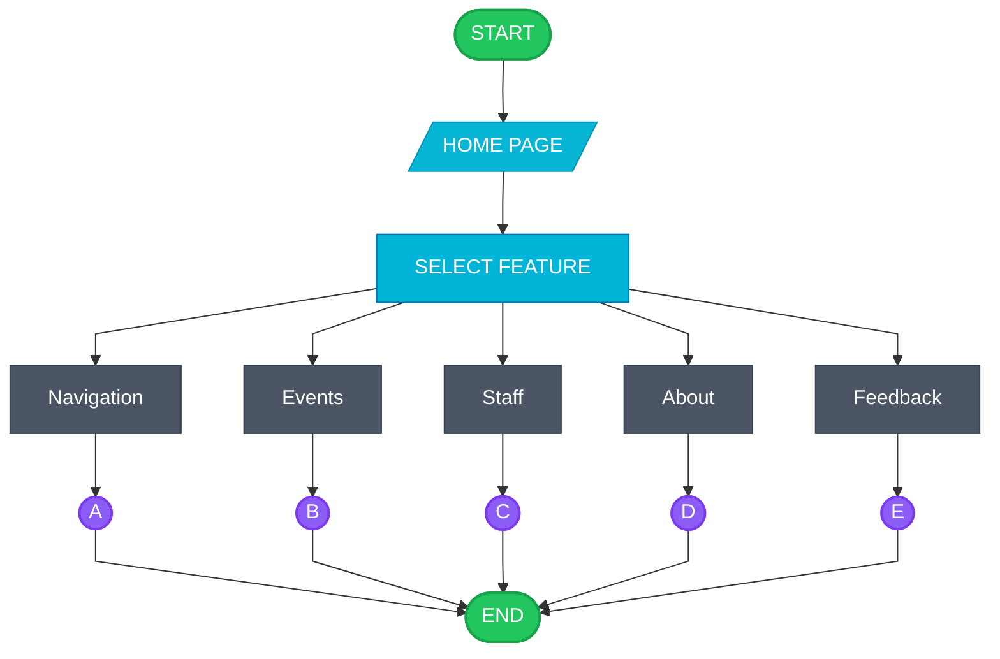
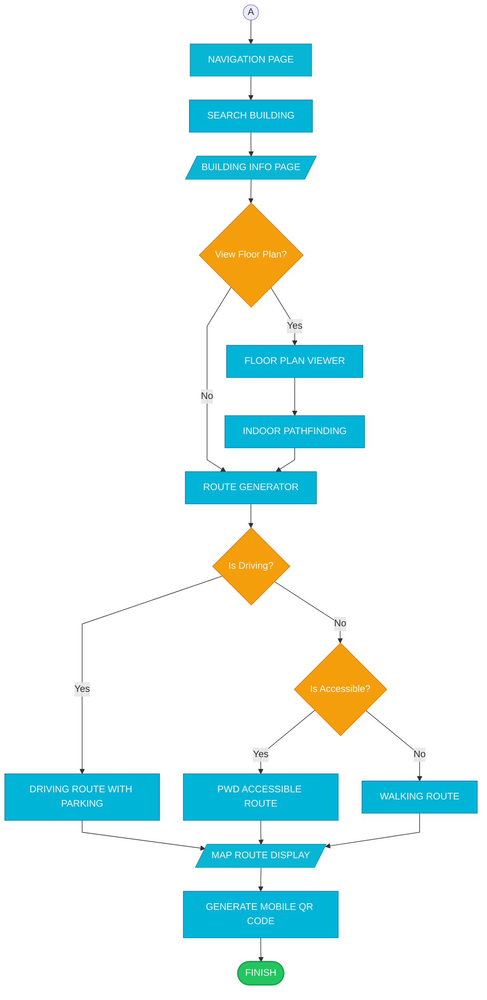
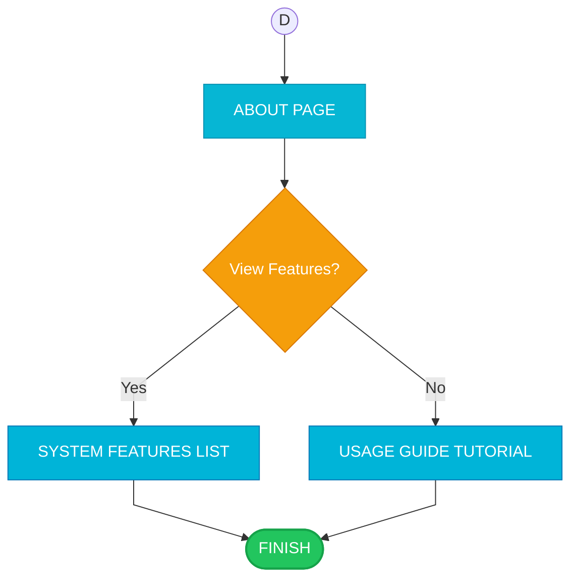
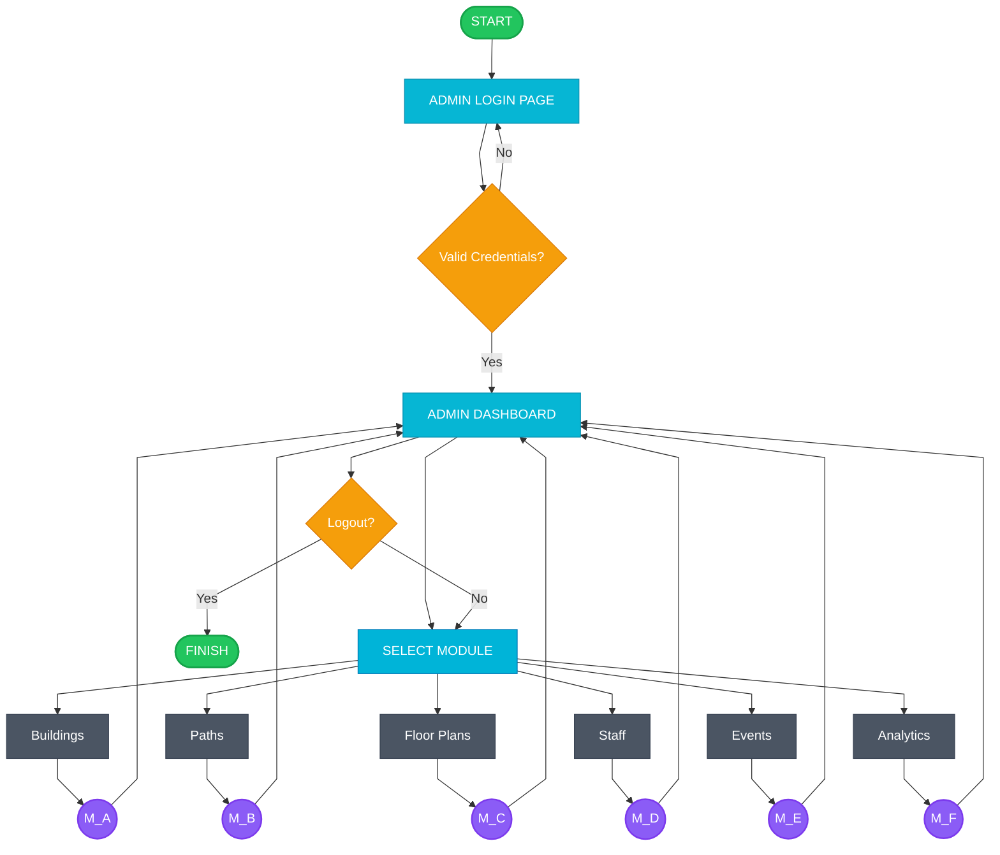
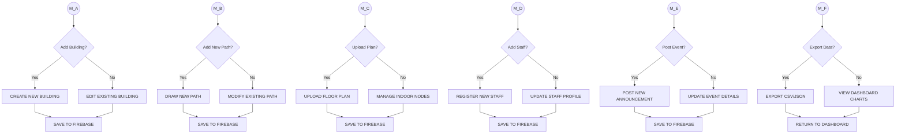
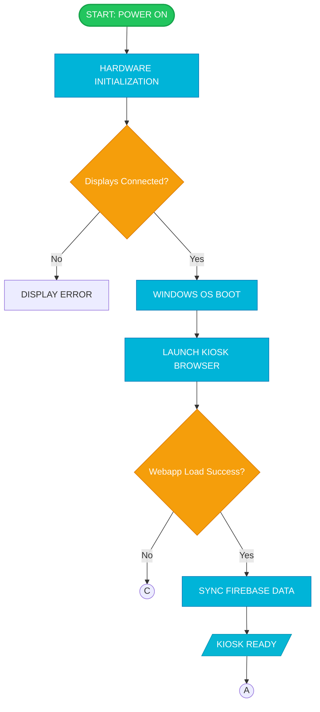
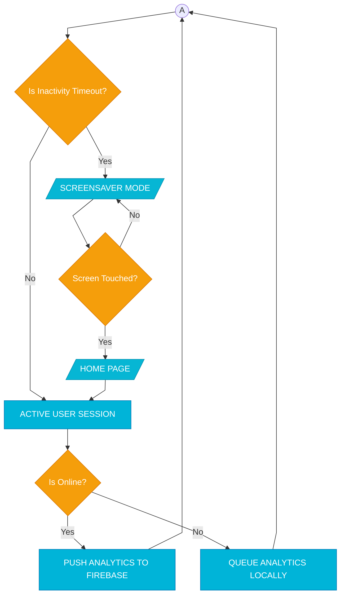
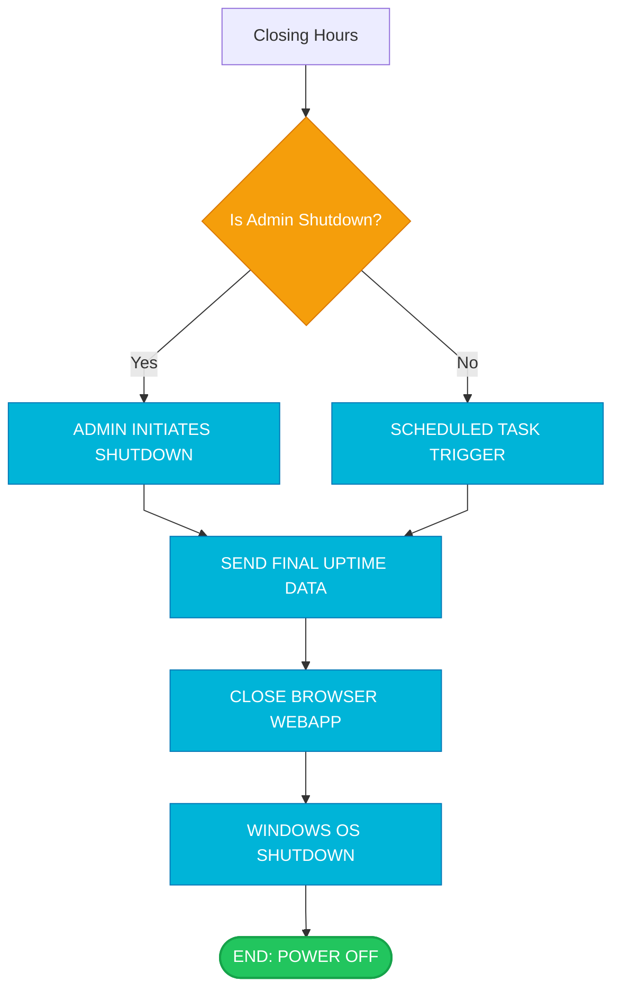
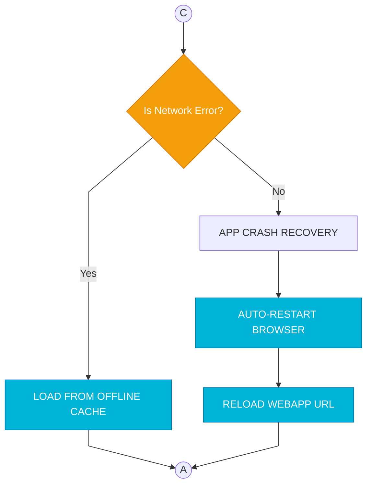

# iCCAT Academic Flowcharts - Printable Edition
## Interactive Campus Companion & Assistance Terminal

This document contains comprehensive, academic-style flowcharts for the iCCAT system. Each diagram follows a structured linear progression, using binary decisions only, and follows the university's prescribed visual format.

---

## User Perspective Flowcharts

### User Flow 1: Main Session Overview

### User Flow 2: Section A - Campus Navigation Page

### User Flow 3: Section B - Events & Announcements Page

### User Flow 4: Section C - Staff Directory Page

### User Flow 5: Section D - About Page

---

## Admin Perspective Flowcharts

### Admin Flow 1: System Management Dashboard

### Admin Flow 2: Module Management Details

---

## Kiosk System Flowcharts

### System Flow 1: Kiosk Startup Sequence

### System Flow 2: Operational Loop

### System Flow 3: Closing Procedures

### System Flow 4: Error Handling

