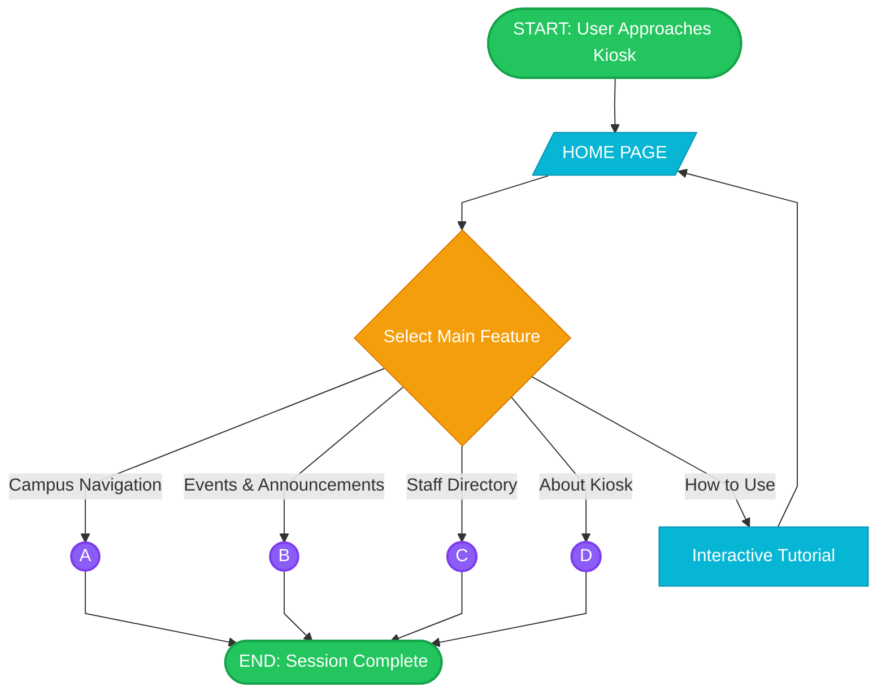
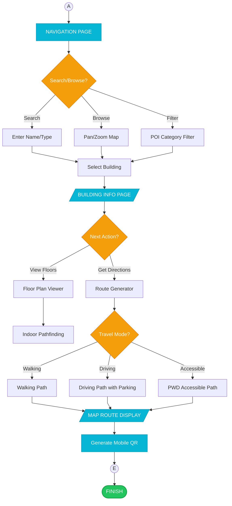
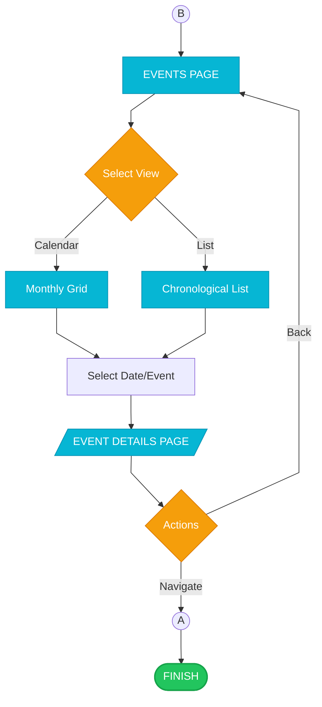
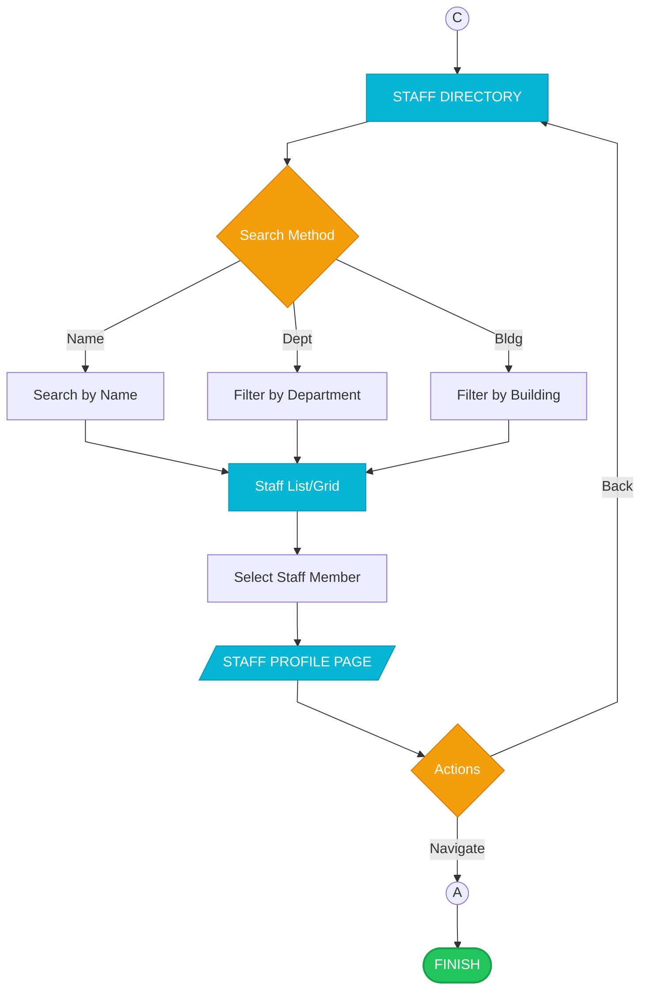
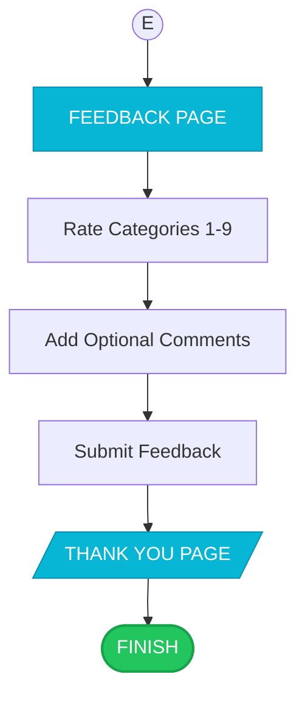
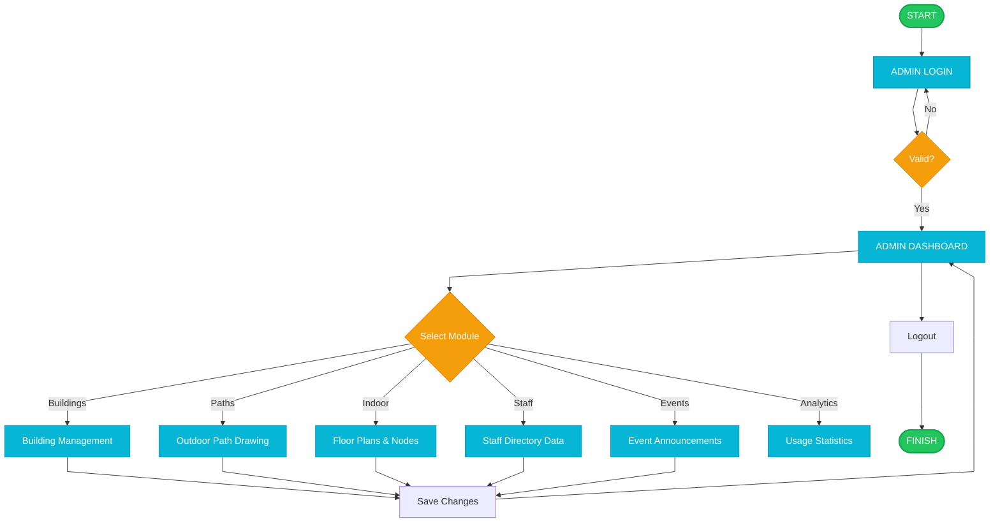

# iCCAT Academic Flowcharts - Printable Edition
## Interactive Campus Companion & Assistance Terminal

This document contains comprehensive, academic-style flowcharts for the iCCAT system. Each diagram follows a structured linear progression with clear, non-overlapping paths.

---

## User Perspective Flowcharts

### User Flow 1: Main Session Overview

### User Flow 2: Section A - Campus Navigation

### User Flow 3: Section B - Events & Announcements

### User Flow 4: Section C - Staff Directory

### User Flow 5: Section E - Feedback System

---

## Admin Perspective Flowcharts

### Admin Flow 1: System Management

