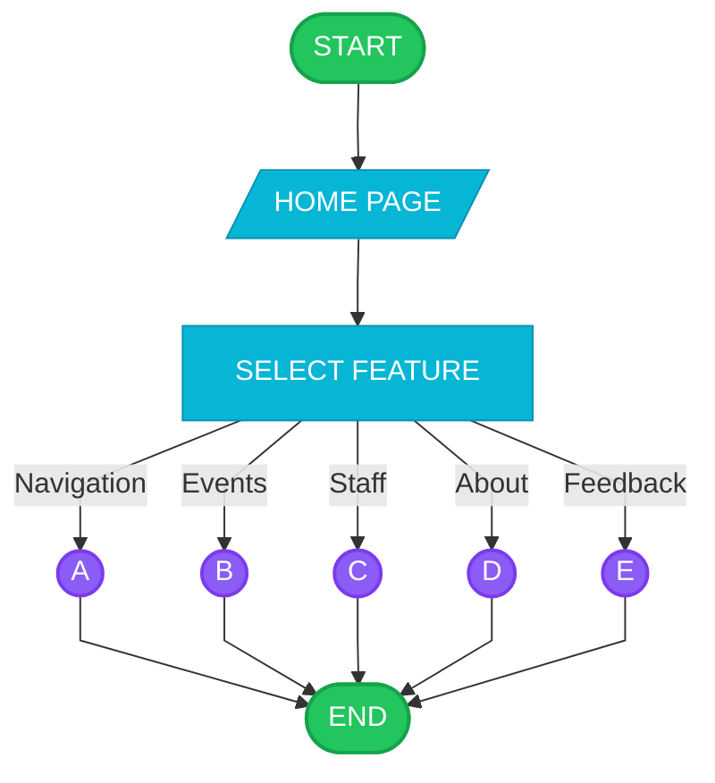
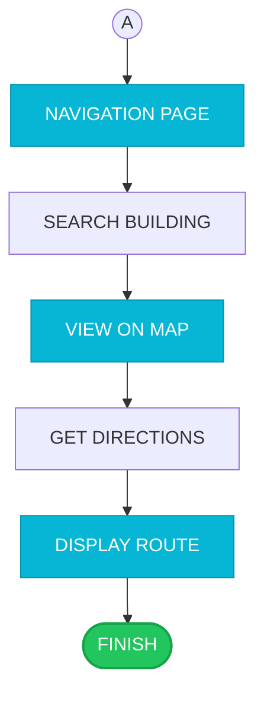
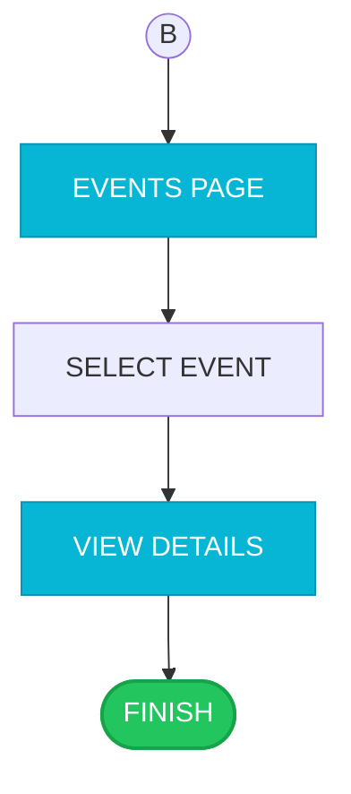
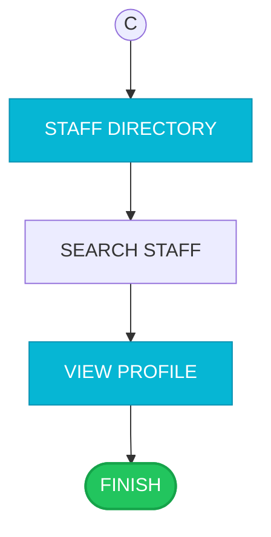
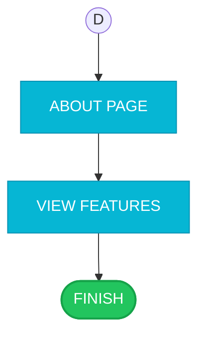
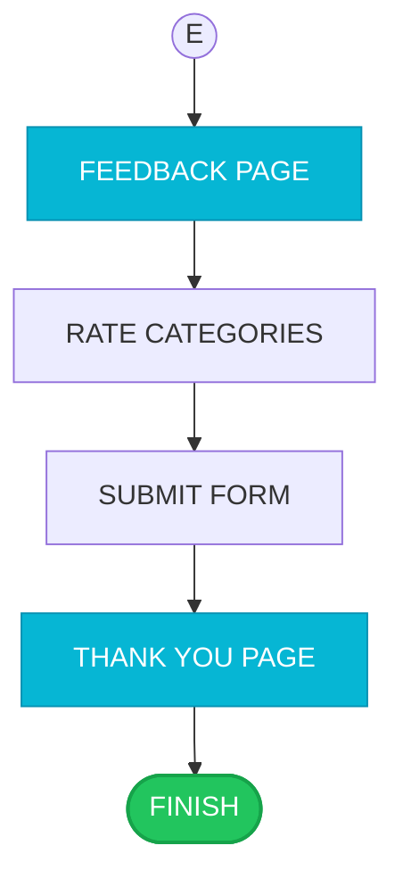
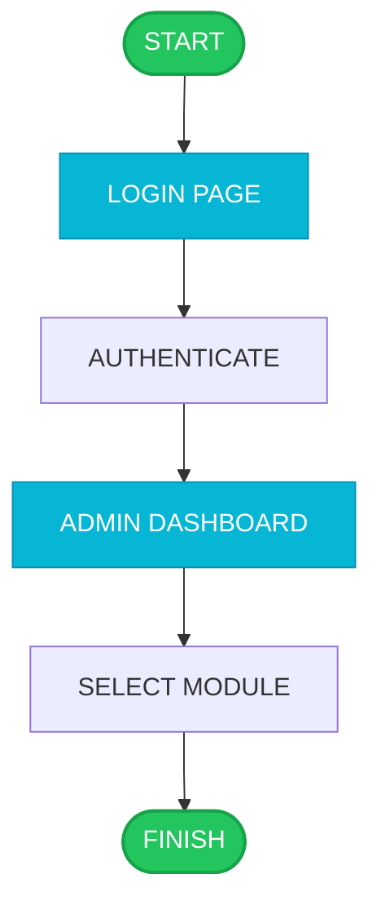

# iCCAT Academic Flowcharts - Printable Edition
## Interactive Campus Companion & Assistance Terminal

This document contains simplified, academic-style flowcharts for the iCCAT kiosk system. Each diagram follows a linear progression with minimal decision points for maximum clarity.

---

## User Perspective Flowcharts

### User Flow 1: Main Session Overview

### User Flow 2: Section A - Campus Navigation

### User Flow 3: Section B - Events & Announcements

### User Flow 4: Section C - Staff Directory

### User Flow 5: Section D - About Page

### User Flow 6: Section E - Feedback

---

## Admin Perspective Flowcharts

### Admin Flow 1: Login & Dashboard

